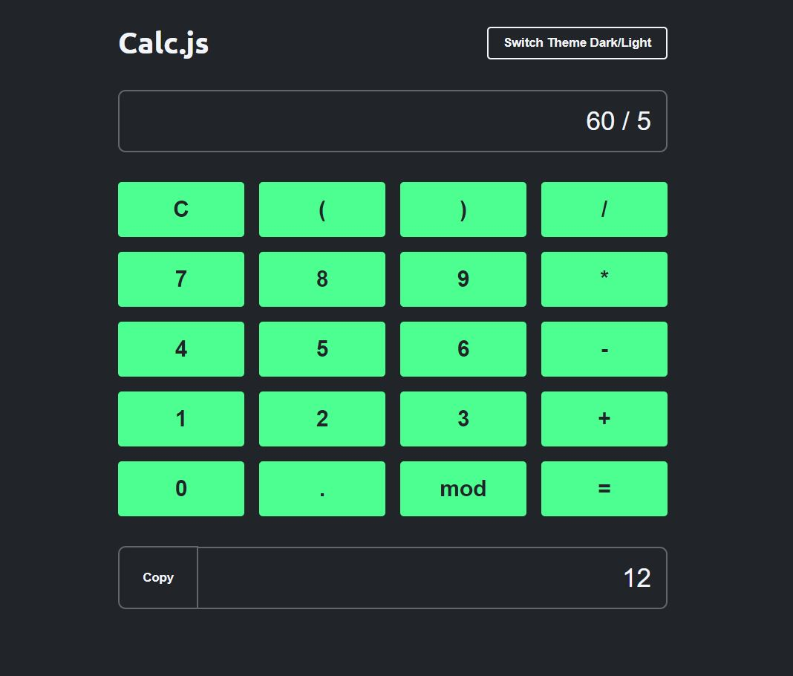
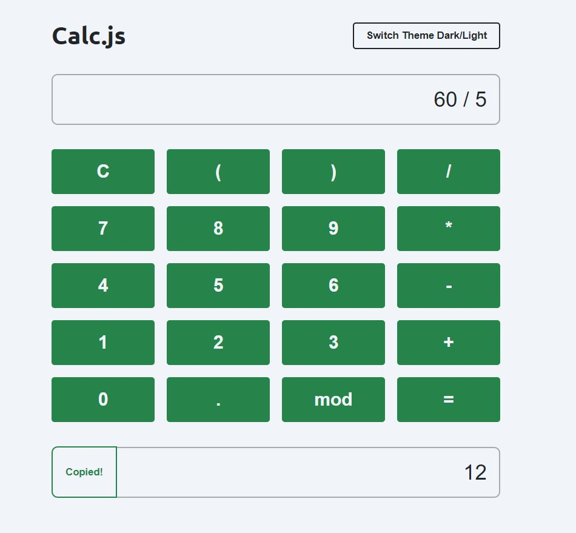

# Calculadora Javascript

Esta calculadora foi desenvolvida em Javascript e possui as funções básicas de uma calculadora, com botões para apagar, copiar o resultado no clipboard, e também para alternar o tema entre claro e escuro.

## Screenshot

## Techs

- HTML
- CSS responsivo
- Javascript
